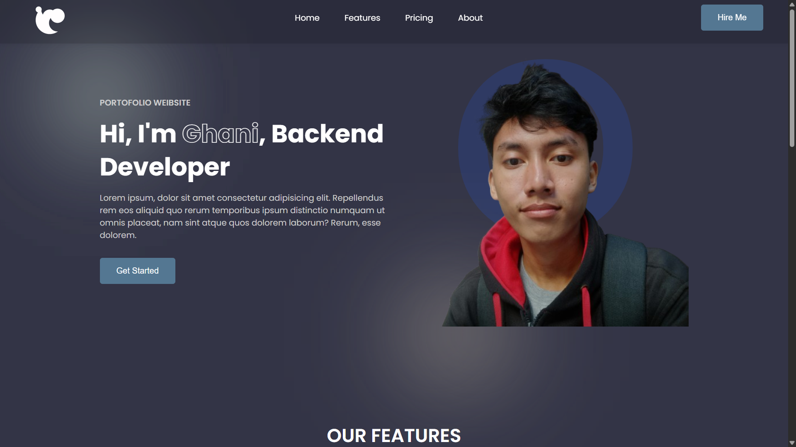

# Personal Portfolio Design
This project was created as part of my learning process in web development. The main goal is to deepen my understanding of the technologies used and to practice building real-world projects.

In addition, this website also serves as my personal portfolio, showcasing my learning progress and the projects I’ve worked on. Hopefully, this project can demonstrate the growth of my skills in web development, especially in backend development.

This project will continue to be developed as I gain more knowledge and experience.

# Screenshot
Here we have project screenshot :

